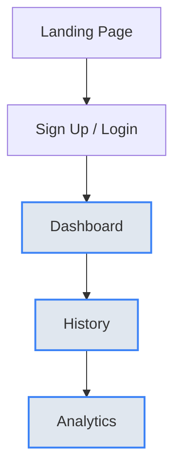
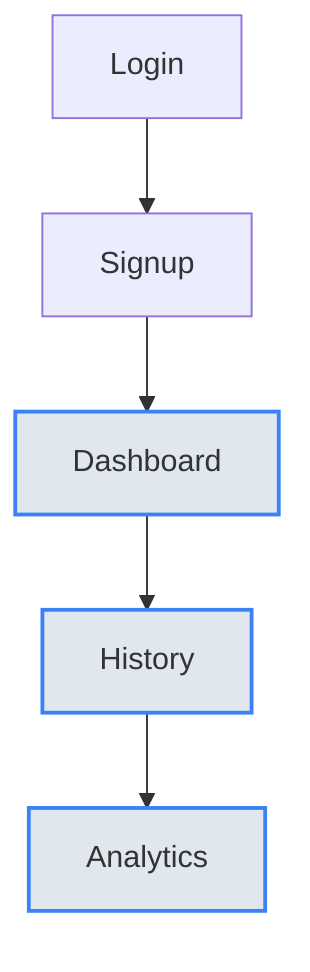
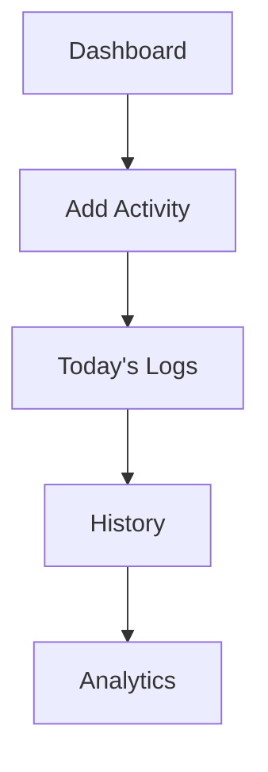
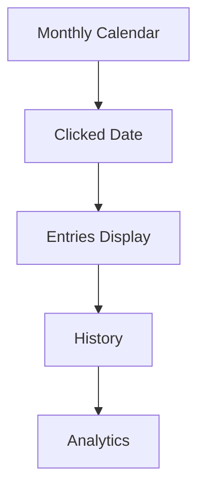
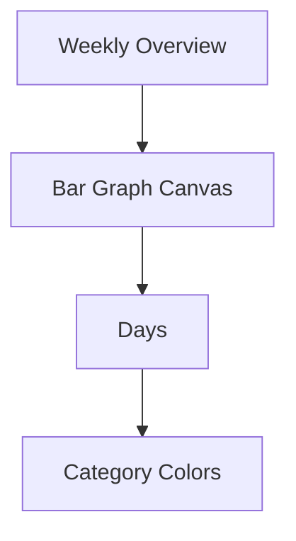

# 🎯 Focus & Habit Tracker
---

## 🖼️ Wireframe & UI Planning Reference

---

### 🧭 User Flow Overview



- Smooth navigation, protected routes, and micro-product structure.

---

### 🔐 Authentication Flow

**Pages:**
- `/signup`
- `/login`
- `/dashboard` (protected)

**Flow:**
1. User lands on Login page.
2. If new → clicks "Create Account".
3. After authentication:
	- JWT stored in httpOnly cookie
	- Redirect to Dashboard
4. Protected routes verify token before rendering.

---

### 🖥️ Wireframe Layouts (Low Fidelity)

#### Login & Signup Flow

- Minimal dark theme, smooth fade-in, validation errors below inputs.

#### Signup Page
```
┌─────────────────────────────┐
│     Create Account         │
│────────────────────────────│
│   [ Name Input ]           │
│   [ Email Input ]          │
│   [ Password Input ]       │
│                           │
│     ( Register )           │
│                           │
│ Already have account? Login│
└─────────────────────────────┘
```
- Real-time validation, password strength indicator, success toast.

#### Dashboard & Activity Flow

- Smooth list animation, instant UI update, color badges.

#### History Calendar Flow

- Click animation, expand/collapse logs, highlight days.

#### Analytics Visualization Flow

- Bars represent total duration, colors for category, animated upward.

---

### 🎨 UI Theme Planning

- Dark Productivity UI
- Color Palette:
  - Background: #0f172a
  - Card: #1e293b
  - Primary: #3b82f6
  - Work: teal
  - Study: blue
  - Exercise: orange
  - Break: pink
  - Other: gray
- Typography: Clean sans-serif, bold headers

---

### 🔄 State & Data Flow

- React Context/Zustand for auth
- Axios for API
- Express REST API, JWT, MongoDB
- User Action → API → DB → UI
- Analytics → Aggregated Query → Three.js Mapping

---

### 📊 Analytics Calculation Logic

- Weekly analytics: total duration per day, category distribution
- Group logs by date, sum duration, map to bar heights
- Animate bars using Three.js
- Height formula: `barHeight = (duration / maxDurationOfWeek) * MAX_BAR_HEIGHT`

---

## 🚀 Features
---

- **User Authentication**: Secure registration, login, and JWT-based session management.
- **Activity Logging**: Track activities by category (Work, Study, Exercise, Break, Other) with duration and timestamps.
- **Analytics Dashboard**: Visualize your productivity with weekly analytics, bar/line charts, and best day/category highlights.
- **Calendar History**: Browse and filter your activity history by date and category.
- **Responsive UI**: Modern, mobile-friendly design with smooth animations.

---

## 🗂️ Project Structure

```
Focus and Habit Tracker/
│
├── backend/                  # Node.js + Express + MongoDB backend
│   ├── src/
│   │   ├── controller/       # Route controllers (activity.controller.js, user.controller.js)
│   │   ├── db/               # Database connection (db_connect.js)
│   │   ├── middlewares/      # Auth, multer, etc. (auth.middleware.js, multer.middleware.js)
│   │   ├── models/           # Mongoose models (activity.model.js, user.models.js)
│   │   ├── routes/           # Express routes (activity.route.js, user.route.js)
│   │   ├── utils/            # Utility functions (apiError.utils.js, apiResponse.utils.js, asyncHandler.utils.js)
│   │   ├── app.js            # Express app setup
│   │   ├── constant.js       # Constants
│   │   └── index.js          # Entry point
│   ├── package.json
│   ├── vercel.json
│   └── public/               # Static/public files
│
├── frontend/                 # React + Vite frontend
│   ├── src/
│   │   ├── api/              # Axios instance
│   │   ├── components/       # UI components
│   │   ├── pages/            # Main pages (History, Login, Signup)
│   │   └── store/            # Redux slices
│   ├── package.json
│   └── vercel.json
│
└── README.md                 # Project documentation
```

---

## 🛠️ Tech Stack
---

- **Frontend**: React, Vite, Tailwind CSS, Framer Motion, date-fns, Axios
- **Backend**: Node.js, Express, MongoDB, Mongoose, JWT, bcrypt, multer, Cloudinary
- **Deployment**: Vercel (for both frontend and backend)

---

## ⚙️ Environment Setup

### 1. Backend (`backend`)

#### Install dependencies
```bash
cd backend
npm install
```

#### Environment Variables
Create a `.env` file in `backend/` with the following:

```
PORT=5000
MONGODB_URI=your_mongodb_connection_string
DB_NAME=focus_habit_db
ACCESS_TOKEN_SECRET=your_access_token_secret
REFRESH_TOKEN_SECRET=your_refresh_token_secret
CLOUDINARY_CLOUD_NAME=your_cloudinary_cloud_name
CLOUDINARY_API_KEY=your_cloudinary_api_key
CLOUDINARY_API_SECRET=your_cloudinary_api_secret
```

#### Run the backend
```bash
npm start
```

---

### 2. Frontend (`frontend`)

#### Install dependencies
```bash
cd frontend
npm install
```

#### Environment Variables
Create a `.env` file in `frontend/` with the following:

```
VITE_API_URL=http://localhost:5000
```

#### Run the frontend
```bash
npm run dev
```

---

## 🌐 API Endpoints

### Auth
- `POST /users/register` — Register a new user
- `POST /users/login` — Login
- `POST /users/logout` — Logout
- `POST /users/refresh-token` — Refresh JWT
- `GET /users/me` — Get current user profile

### Activities
- `POST /activities/create-Activity` — Log a new activity
- `GET /activities` — Get all activities
- `GET /activities/range?startDate=YYYY-MM-DD&endDate=YYYY-MM-DD` — Activities in date range
- `GET /activities/weekly-analytics` — Weekly analytics data
- `DELETE /activities/:activityId` — Delete an activity

---

## 📦 Deployment
---

- Both frontend and backend are ready for Vercel deployment. See `vercel.json` in each folder for configuration.

---

## 📝 Notes

### Bar Chart Visualization Problem & Solution

**Problem:**
When using chart libraries, empty spaces appeared in the bar chart if a category was not present for a day. This made the chart visually confusing and inconsistent.

**Solution:**
- We decided to manually render the bar chart using custom animation and math calculations.
- Heights of bars are calculated based on activity duration.
- Each bar is colored according to its category.
- Bars are positioned correctly for each day, ensuring no empty spaces and a clear, accurate visualization.
- This approach provides full control over the chart layout and improves user experience.

---

- All dates are stored in MongoDB as UTC. The frontend and backend use JavaScript's `Date` object for all date handling to ensure consistency.
- Profile images are uploaded to Cloudinary. You must set up a Cloudinary account and provide the credentials in your backend `.env`.
- For local development, ensure both frontend and backend are running and the API URL is set correctly in the frontend `.env`.

---

## 🙏 Credits

- Built by Abhijeet and contributors.
- Inspired by productivity and habit-tracking best practices.

---

## 📧 Contact

For questions, suggestions, or contributions, please open an issue or contact the maintainer.
