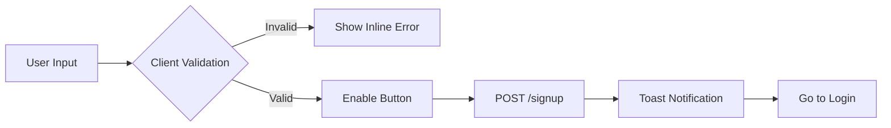
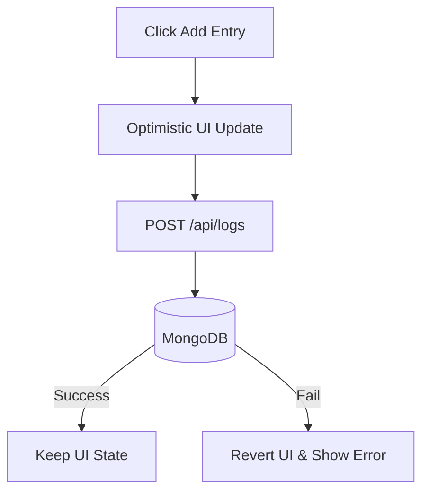
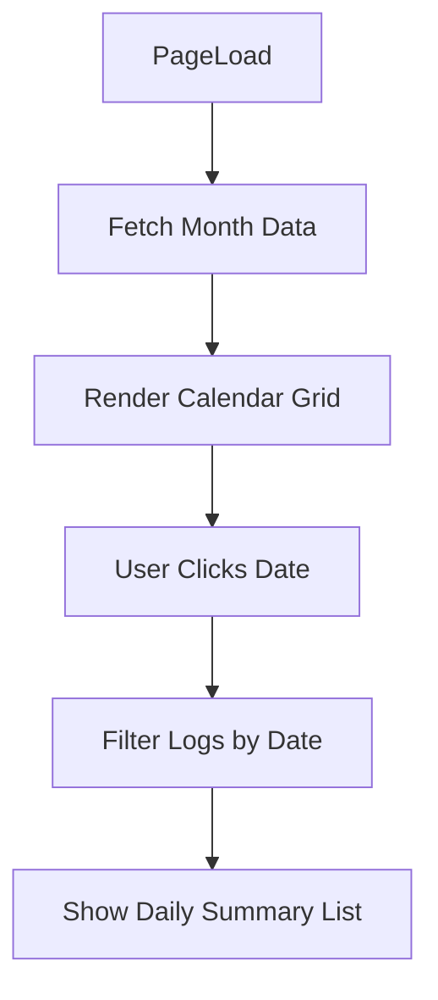
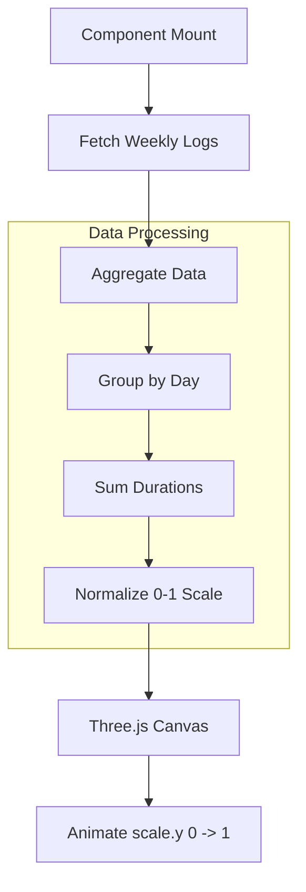

# 🎯 Focus & Habit Tracker
## UI Wireframe & Design Planning Reference

---

## 1. 🖼️ User Flow & Navigation Structure

### 🧭 Global Navigation Path
This diagram represents the high-level navigation path and access control for the application.

```mermaid
flowchart TD
    Landing[Landing Page] --> Check{Has Account?}
    Check -- No --> Signup[Sign Up Page]
    Check -- Yes --> Login[Login Page]
    
    Signup --> Login
    Login --> Auth{Verify Credentials}
    
    Auth -- Success --> Dash[Dashboard]
    Auth -- Fail --> Error[Show Error Toast]

    subgraph Protected App Shell
        Dash <--> History[History View]
        History <--> Analytics[Analytics View]
    end

    Dash --> Logout[Logout Action]
    Logout --> Login
---

## 2. 🔐 Authentication & Data Lifecycle

### 🔄 Auth Sequence

The following flow describes how user credentials and tokens are handled between the client and server.

```mermaid
sequenceDiagram
    actor User
    participant FE as Frontend (React)
    participant BE as Backend (Express)
    participant DB as MongoDB

    User->>FE: Enters Email & Password
    FE->>BE: POST /api/auth/login
    BE->>DB: Find User & Compare Hash
    alt Invalid Credentials
        DB-->>BE: null
        BE-->>FE: 401 Unauthorized
        FE-->>User: Show Error Toast
    else Valid Credentials
        DB-->>BE: User Object
        BE->>BE: Generate JWT
        BE-->>FE: Set httpOnly Cookie + User Data
        FE->>FE: Update Global Auth State
        FE->>User: Redirect to Dashboard
    end

```

---

## 3. 🖥️ UI Wireframes & Logic

### 3.1 Signup & Registration

**Goal:** Minimalist entry with real-time feedback.

#### 🎨 UI Layout

```text
+------------------------------------------+
|            Create Account                |
|------------------------------------------|
|        [ Name Input ]                    |
|        [ Email Input ]                   |
|        [ Password Input ]                |
|                                          |
|  [Strength: ●●●○○ Moderate]              |
|                                          |
|            ( Register )                  |
|                                          |
|    Already have an account? Login        |
+------------------------------------------+

```

#### ⚙️ Logic Flow



---

### 3.2 Dashboard (Daily Log Section)

**Goal:** Quick data entry and immediate feedback.

#### 🎨 UI Layout

```text
+------------------------------------------------------+
| Logo | Dashboard | History | Analytics | Logout      |
|------------------------------------------------------|
|  Add Activity                                        |
|  --------------------------------------------------  |
|  [ Activity Name ] [ Duration (m) ] [ Category ▼ ]   |
|                      ( Add Entry )                   |
|                                                      |
|  Today's Logs                                        |
|  --------------------------------------------------  |
|  🟢 Work - 120 min       [ Delete ]                  |
|  🔵 Study - 60 min       [ Delete ]                  |
|  🟠 Exercise - 45 min    [ Delete ]                  |
+------------------------------------------------------+

```

#### ⚙️ Data Flow



---

### 3.3 History View (Calendar-Based)

**Goal:** Visualizing consistency over time.

#### 🎨 UI Layout

```text
+------------------------------------------------------+
| Logo | Dashboard | History | Analytics | Logout      |
|------------------------------------------------------|
|                  Monthly Calendar                    |
|  --------------------------------------------------  |
|  [ < ]       February 2026       [ > ]               |
|                                                      |
|  [ 1 ][ 2 ][ 3 ][ 4 ][ 5 ][ 6 ][ 7 ]                 |
|  [ 8 ][ 9 ][10 ][11 ][12 ][13 ][14 ]                 |
|                                                      |
|  Clicked Date (Feb 12) → Entries Display Below       |
|  --------------------------------------------------  |
|  🟢 Work - 90 min                                    |
|  🟠 Exercise - 30 min                                |
+------------------------------------------------------+

```

#### ⚙️ Interaction Flow



---

### 3.4 Analytics View (3D Visualization)

**Goal:** High-level overview of weekly performance using Three.js.

#### 🎨 UI Layout

```text
+------------------------------------------------------+
| Logo | Dashboard | History | Analytics | Logout      |
|------------------------------------------------------|
|                Weekly Overview                       |
|                                                      |
|        [ Three.js 3D Bar Graph Canvas ]              |
|          (Bars animate upwards on load)              |
|                                                      |
|      Mon   Tue   Wed   Thu   Fri   Sat   Sun       |
|                                                      |
|      Total Hours: 32.5   |   Top Category: Work      |
+------------------------------------------------------+

```

#### ⚙️ Visualization Logic



---

## 4. 🎨 UI Theme Planning

**Theme:** Dark Productivity UI

**Color Palette:**

* **Background:** `#0f172a` (Slate 900)
* **Card/Surface:** `#1e293b` (Slate 800)
* **Primary Action:** `#3b82f6` (Blue 500)
* **Text Main:** `#f8fafc` (Slate 50)
* **Text Muted:** `#94a3b8` (Slate 400)

**Category Colors:**

* 🟢 **Work:** `#10b981` (Emerald)
* 🔵 **Study:** `#3b82f6` (Blue)
* 🟠 **Exercise:** `#f59e0b` (Amber)
* 🌸 **Break:** `#ec4899` (Pink)
* ⚪ **Other:** `#64748b` (Slate)

---

## 5. 📊 Analytics Calculation Logic

**Objective:** Map raw duration data to 3D bar heights.

1. **Input:** Array of logs from `startOfWeek` to `endOfWeek`.
2. **Processing:**
* Group logs by date.
* Sum `duration` for each date.
* Find `maxDuration` in the current week.


3. **Formula for 3D Height:**

---

## 6. 🏗️ Project Structure

```text
frontend/
  src/
    ├── assets/
    ├── components/
    │   ├── Navbar.jsx
    │   ├── ActivityForm.jsx
    │   ├── ActivityList.jsx
    │   ├── CalendarView.jsx
    │   ├── ThreeBarChart.jsx
    │   └── ProtectedRoute.jsx
    ├── pages/
    │   ├── Login.jsx
    │   ├── Signup.jsx
    │   ├── Dashboard.jsx
    │   ├── History.jsx
    │   └── Analytics.jsx
    ├── context/
    │   └── AuthContext.jsx
    ├── services/
    │   └── api.js
    └── App.jsx

backend/
  ├── config/
  │   └── db.js
  ├── controllers/
  │   ├── authController.js
  │   └── logController.js
  ├── models/
  │   ├── User.js
  │   └── Log.js
  ├── routes/
  │   ├── authRoutes.js
  │   └── logRoutes.js
  ├── middleware/
  │   └── authMiddleware.js
  └── server.js

```

---

## 7. 🎯 Design Goals Checklist

* [ ] **Structured SaaS product:** Clean separation of concerns.
* [ ] **Data-driven:** Every UI element reflects real database state.
* [ ] **Animated & Interactive:** Smooth transitions and 3D elements.
* [ ] **Production-ready:** Secure auth, validation, and error handling.

```

```