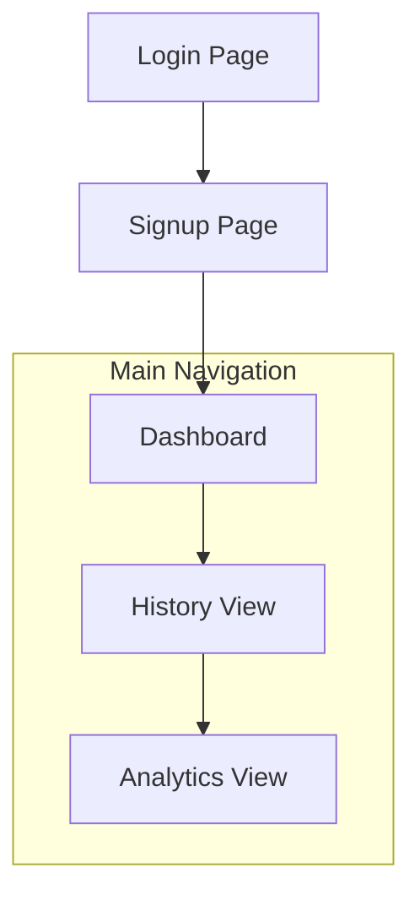
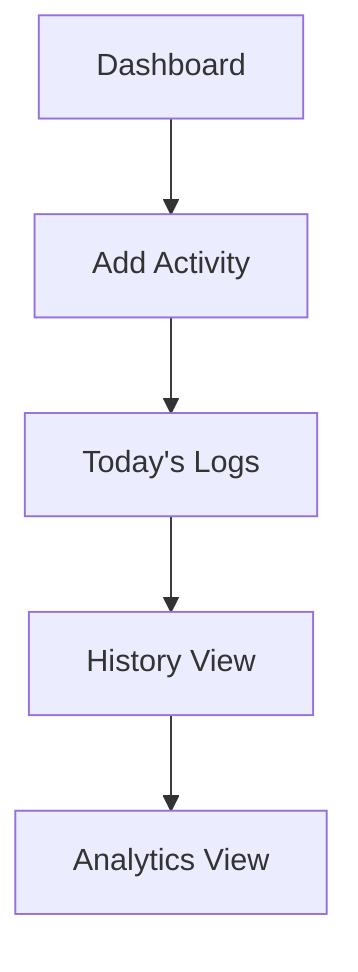
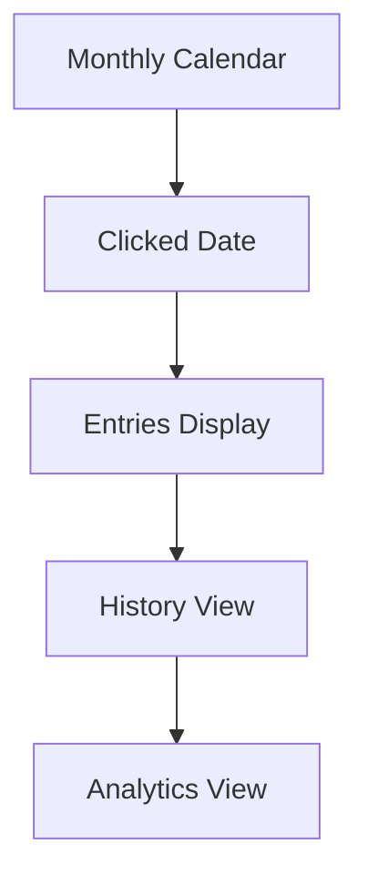
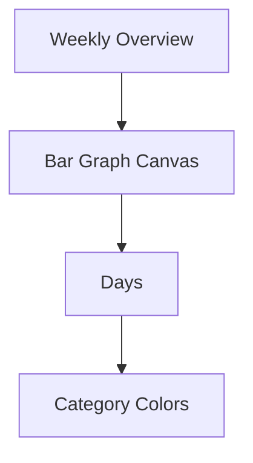

# 🎯 Focus & Habit Tracker  
## UI Wireframe & Design Planning Reference

---

# 🎯 Focus & Habit Tracker
---

## 🖼️ Wireframe & UI Planning Reference

---


### 🧭 User Flow Overview

```mermaid
flowchart TD
   A[Landing Page] --> B[Sign Up / Login]
   B --> C[Dashboard (Daily Log Section)]
   C --> D[History View]
   D --> E[Analytics View (Three.js Visualization)]
   subgraph Protected Routes
      C
      D
      E
   end
```

- Smooth navigation, protected routes, and micro-product structure.

---

### 🔐 Authentication Flow

**Pages:**
- `/signup`
- `/login`
- `/dashboard` (protected)

**Flow:**
1. User lands on Login page.
2. If new → clicks "Create Account".
3. After authentication:
   - JWT stored in httpOnly cookie
   - Redirect to Dashboard
4. Protected routes verify token before rendering.

---

### 🖥️ Wireframe Layouts (Low Fidelity)


#### Login & Signup Flow

- Minimal dark theme, smooth fade-in, validation errors below inputs.

#### Signup Page
```
┌─────────────────────────────┐
│     Create Account         │
│────────────────────────────│
│   [ Name Input ]           │
│   [ Email Input ]          │
│   [ Password Input ]       │
│                           │
│     ( Register )           │
│                           │
│ Already have account? Login│
└─────────────────────────────┘
```
- Real-time validation, password strength indicator, success toast.


#### Dashboard & Activity Flow

- Smooth list animation, instant UI update, color badges.


#### History Calendar Flow

- Click animation, expand/collapse logs, highlight days.


#### Analytics Visualization Flow

- Bars represent total duration, colors for category, animated upward.

---

### 🎨 UI Theme Planning

- Dark Productivity UI
- Color Palette:
  - Background: #0f172a
  - Card: #1e293b
  - Primary: #3b82f6
  - Work: teal
  - Study: blue
  - Exercise: orange
  - Break: pink
  - Other: gray
- Typography: Clean sans-serif, bold headers

---

### 🔄 State & Data Flow

- React Context/Zustand for auth
- Axios for API
- Express REST API, JWT, MongoDB
- User Action → API → DB → UI
- Analytics → Aggregated Query → Three.js Mapping

---

### 📊 Analytics Calculation Logic

- Weekly analytics: total duration per day, category distribution
- Group logs by date, sum duration, map to bar heights
- Animate bars using Three.js
- Height formula: `barHeight = (duration / maxDurationOfWeek) * MAX_BAR_HEIGHT`

---

### 🏗️ Project Structure

frontend/
  pages/
    Login.jsx
    Signup.jsx
    Dashboard.jsx
    History.jsx
    Analytics.jsx
  components/
    Navbar.jsx
    ActivityForm.jsx
    ActivityList.jsx
    CalendarView.jsx
    ThreeBarChart.jsx

backend/
  routes/
    auth.routes.js
    log.routes.js
  controllers/
  models/
  middleware/

---

### 🚀 Interaction & Animation

- Button hover transitions
- Smooth add/delete animations
- Expand history sections
- Three.js bar animation on load
- Fade transitions between routes

---

### 📌 Assumptions & Decisions

- Time stored in UTC
- Weekly analytics starts from Sunday
- No orbit controls in Three.js
- JWT stored in httpOnly cookie
- Fully responsive layout

---

### 🎯 Design Goals

- Structured SaaS product
- Data-driven, animated, interactive
- Clean engineering separation
- Production-ready micro-product

---

+--------------------------------------+
|            Create Account            |
|--------------------------------------|
|            [ Name Input ]            |
|            [ Email Input ]           |
|            [ Password Input ]        |
|                                      |
|              ( Register )            |
|                                      |
|      Already have account? Login     |
+--------------------------------------+

UX:
- Real-time validation
- Password strength indicator
- Success toast notification

---

## 🔹 3.3 Dashboard (Daily Log Section)

+------------------------------------------------------+
| Logo | Dashboard | History | Analytics | Logout     |
|------------------------------------------------------|
|  Add Activity                                        |
|  --------------------------------------------------  |
|  [ Activity Name ] [ Duration ] [ Category ▼ ]      |
|                      ( Add Entry )                   |
|                                                      |
|  Today's Logs                                       |
|  --------------------------------------------------  |
|  Work - 120 min     [ Delete ]                      |
|  Study - 60 min     [ Delete ]                      |
+------------------------------------------------------+

UX:
- Smooth list animation on add/delete
- Instant UI update
- Duration validation
- Category color badges

---

## 🔹 3.4 History View (Calendar-Based)

+------------------------------------------------------+
| Logo | Dashboard | History | Analytics | Logout     |
|------------------------------------------------------|
|                 Monthly Calendar                     |
|  --------------------------------------------------  |
|  [ 1 ][ 2 ][ 3 ][ 4 ][ 5 ][ 6 ][ 7 ]                |
|                                                      |
|  Clicked Date → Entries Display Below               |
|                                                      |
|  12 Feb                                              |
|  Work - 90 min                                       |
|  Exercise - 30 min                                   |
+------------------------------------------------------+

UX:
- Click animation on date
- Expand/collapse day logs
- Highlight days with activity

---

## 🔹 3.5 Analytics View (Three.js Visualization)

+------------------------------------------------------+
| Logo | Dashboard | History | Analytics | Logout     |
|------------------------------------------------------|
|                Weekly Overview                       |
|                                                      |
|        [ Three.js 3D Bar Graph Canvas ]             |
|                                                      |
|     Mon   Tue   Wed   Thu   Fri   Sat   Sun         |
+------------------------------------------------------+

Visualization Logic:
- Bars represent total duration per day
- Colors represent category dominance
- Bars animate upward on mount
- Data fetched from API (no hardcoded values)

---

# 🎨 4. UI Theme Planning

Theme: Dark Productivity UI

Color Palette:
- Background: #0f172a
- Card: #1e293b
- Primary: #3b82f6
- Work: teal
- Study: blue
- Exercise: orange
- Break: pink
- Other: gray

Typography:
- Clean sans-serif
- Clear hierarchy
- Bold section headers

---

# 🔄 5. State & Data Flow Planning

Frontend:
- React Context / Zustand for auth state
- Axios for API calls
- ProtectedRoute wrapper

Backend:
- Express REST API
- JWT Authentication
- MongoDB persistent storage

Data Flow:

User Action → API → Database  
Database → API Response → Frontend State → UI Render  
Analytics → Aggregated Query → Three.js Mapping  

---

# 📊 6. Analytics Calculation Logic (Planning)

Weekly Analytics Includes:

1. Total duration per day
2. Category distribution per week

Process:

1. Fetch logs from startOfWeek → endOfWeek
2. Group by date
3. Sum duration
4. Map values to bar heights
5. Animate using Three.js scale.y

Height Formula:

barHeight = (duration / maxDurationOfWeek) * MAX_BAR_HEIGHT

---

# 🏗️ 7. Project Structure Planning

frontend/
  pages/
    Login.jsx
    Signup.jsx
    Dashboard.jsx
    History.jsx
    Analytics.jsx
  components/
    Navbar.jsx
    ActivityForm.jsx
    ActivityList.jsx
    CalendarView.jsx
    ThreeBarChart.jsx

backend/
  routes/
    auth.routes.js
    log.routes.js
  controllers/
  models/
  middleware/

---

# 🚀 8. Interaction & Animation Planning

- Button hover transitions
- Smooth add/delete animations
- Expand history sections
- Three.js bar animation on load
- Fade transitions between routes

---

# 📌 9. Assumptions & Decisions

- Time stored in UTC
- Weekly analytics starts from Sunday
- No orbit controls in Three.js
- JWT stored in httpOnly cookie
- Fully responsive layout

---

# 🎯 Goal of This Design

The goal is to make the application feel like:

✔ A structured SaaS product  
✔ Data-driven  
✔ Animated and interactive  
✔ Clean engineering separation  
✔ Production-ready micro-product  

---