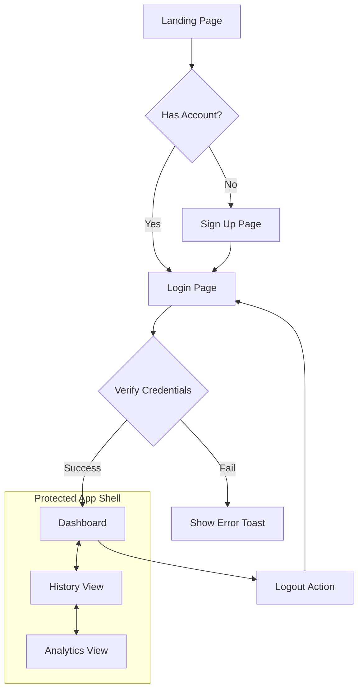
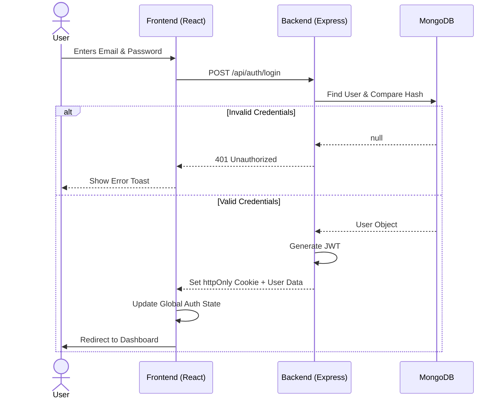

# 🎯 Focus & Habit Tracker
## UI Wireframe & Design Planning Reference

---

## 1. 🖼️ User Flow & Navigation Structure

### 🧭 Global Navigation Path
This diagram represents the high-level navigation path and access control for the application.



---

## 2. 🔐 Authentication & Data Lifecycle

### 🔄 Auth Sequence

The following flow describes how user credentials and tokens are handled between the client and server.



---

## 3. 🖥️ UI Wireframes & Logic

### 3.1 Signup & Registration

**Goal:** Minimalist entry with real-time feedback.

#### 🎨 UI Layout

```text
+------------------------------------------+
|            Create Account                |
|------------------------------------------|
|        [ Name Input ]                    |
|        [ Email Input ]                   |
|        [ Password Input ]                |
|                                          |
|  [Strength: ●●●○○ Moderate]              |
|                                          |
|            ( Register )                  |
|                                          |
|    Already have an account? Login        |
+------------------------------------------+
```

#### ⚙️ Logic Flow


---

### 3.2 Dashboard (Daily Log Section)

**Goal:** Quick data entry and immediate feedback.

#### 🎨 UI Layout

```text
+------------------------------------------------------+
| Logo | Dashboard | History | Analytics | Logout      |
|------------------------------------------------------|
|  Add Activity                                        |
|  --------------------------------------------------  |
|  [ Activity Name ] [ Duration (m) ] [ Category ▼ ]  |
|                      ( Add Entry )                   |
|                                                      |
|  Today's Logs                                        |
|  --------------------------------------------------  |
|  🟢 Work - 120 min       [ Delete ]                  |
|  🔵 Study - 60 min       [ Delete ]                  |
|  🟠 Exercise - 45 min    [ Delete ]                  |
+------------------------------------------------------+
```

#### ⚙️ Data Flow


---

### 3.3 History View (Calendar-Based)

**Goal:** Visualizing consistency over time.

#### 🎨 UI Layout

```text
+------------------------------------------------------+
| Logo | Dashboard | History | Analytics | Logout      |
|------------------------------------------------------|
|                  Monthly Calendar                    |
|  --------------------------------------------------  |
|  [ < ]       February 2026       [ > ]               |
|                                                      |
|  [ 1 ][ 2 ][ 3 ][ 4 ][ 5 ][ 6 ][ 7 ]                 |
|  [ 8 ][ 9 ][10 ][11 ][12 ][13 ][14 ]                 |
|                                                      |
|  Clicked Date (Feb 12) → Entries Display Below       |
|  --------------------------------------------------  |
|  🟢 Work - 90 min                                    |
|  🟠 Exercise - 30 min                                |
+------------------------------------------------------+
```

#### ⚙️ Interaction Flow


---

### 3.4 Analytics View (3D Visualization)

**Goal:** High-level overview of weekly performance using Three.js.

#### 🎨 UI Layout

```text
+------------------------------------------------------+
| Logo | Dashboard | History | Analytics | Logout      |
|------------------------------------------------------|
|                Weekly Overview                       |
|                                                      |
|        [ Three.js 3D Bar Graph Canvas ]              |
|          (Bars animate upwards on load)              |
|                                                      |
|      Mon   Tue   Wed   Thu   Fri   Sat   Sun         |
|                                                      |
|      Total Hours: 32.5   |   Top Category: Work      |
+------------------------------------------------------+
```

#### ⚙️ Visualization Logic


---

## 4. 🎨 UI Theme Planning

**Theme:** Dark Productivity UI

**Color Palette:**

- **Background:** `#0f172a`
- **Card/Surface:** `#1e293b`
- **Primary Action:** `#3b82f6`
- **Text Main:** `#f8fafc`
- **Text Muted:** `#94a3b8`

**Category Colors:**

- 🟢 Work: `#10b981`
- 🔵 Study: `#3b82f6`
- 🟠 Exercise: `#f59e0b`
- 🌸 Break: `#ec4899`
- ⚪ Other: `#64748b`

---

## 5. 📊 Analytics Calculation Logic

**Objective:** Map raw duration data to 3D bar heights.

1. Input: Logs from `startOfWeek` to `endOfWeek`
2. Group logs by date
3. Sum duration per day
4. Find `maxDuration` of the week

**3D Height Formula:**

```
barHeight = (dayDuration / maxDuration) * MAX_BAR_HEIGHT
```

---

## 6. 🏗️ Project Structure

```text
frontend/
  src/
    components/
    pages/
    context/
    services/
    App.jsx

backend/
  config/
  controllers/
  models/
  routes/
  middleware/
  server.js
```

---

## 7. 🎯 Design Goals Checklist

- [ ] Structured SaaS product
- [ ] Data-driven UI
- [ ] Animated & Interactive
- [ ] Production-ready architecture